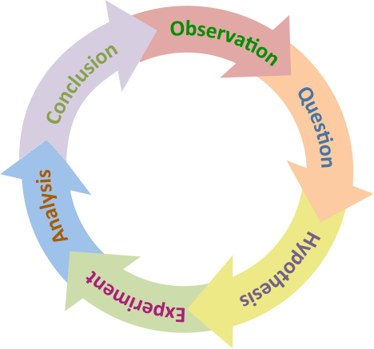

# delta-research

LLM-driven research loop. Copy into any project. The agent reads one file and runs everything.

## Why this exists

Research is messy. You start with a hypothesis, run experiments, and sometimes discover your entire framing was wrong. That's not failure — that's learning. But it's hard to manage manually, especially when you're juggling multiple hypotheses, tracking what you've tried, and deciding what to test next.

The core insight: **what you care about is the hypotheses, not the experiments.** Experiments are just tools to move hypotheses toward supported or rejected. So we delegate experiment design, execution, and bookkeeping to the agent, and you focus on what matters — your beliefs about the problem and whether they hold up.

The agent runs autonomously: it picks the most uncertain hypothesis, designs an experiment to test it, runs it, and updates its beliefs. We can have maximum information gain with most uncertain hypotheses. When a hypothesis turns out to be completely wrong, the system handles that gracefully — it flags dependent beliefs for re-evaluation and keeps going. You check in when you want, read the summary, and steer.

## Key design principles



- **Hypotheses over experiments** — The belief table is the real output. Experiments exist to move beliefs toward supported or rejected. The agent handles the experimental details; you own the hypotheses.
- **Wrong is fine, stuck is not** — Research often means discovering your assumptions were wrong. Rejecting a hypothesis is as valuable as confirming one. The system is designed around this: paradigm shifts are a first-class concept, and dependent beliefs get flagged for re-evaluation automatically.
- **Delta-first** — The unit of progress is *what changed → what happened → what it means*. Every run produces a clear delta.
- **Bisect the hypothesis space** — A good experiment splits uncertain beliefs in two. The agent prioritizes tests with the highest expected information gain.
- **Compatibility with existing tools** — Just use your Claude Code or Codex. No custom infrastructure. We recommend multi-agent mode for Codex.

## Quick start

1. Copy `delta-research/` into your project
2. Activate your environment: `conda activate your-env` or `source venv/bin/activate`
3. Start your code agent. For full autonomy use `--dangerously-skip-permissions` (Claude Code) or `--full-auto` (Codex).
4. Tell your agent: *"Read `./delta-research/README.md` and initialize the research loop"*
5. The agent reads `templates/INIT.md`, interviews you, sets up permissions, detects your environment, and creates `STATE.md`
6. **To start the automated research loop**: Tell your agent: *"Run the research loop"*

The loop runs autonomously — picks deltas, spawns workers, ingests reports, compresses state, repeats. It stops only on interrupt boundaries (budget exceeded, blocker hit, no more hypotheses to test).

Works with Claude Code, OpenAI Codex, Cursor, or any agent that reads markdown and executes commands.

## Initialization

When told to initialize, the agent reads `templates/INIT.md` and will:
1. **Understand the project and write agent instructions** — read the codebase, interview you about research goals/hypotheses/constraints, then write CLAUDE.md/AGENTS.md with project context and research loop pointers
2. **Set up environment** — spawn an environment agent to detect conda/venv, GPUs, verify dependencies, locate checkpoints and datasets
3. **Set up permissions** — configure auto-approval for shell commands so the loop runs without interruption (asks you which level you want)
4. **Create directories** — `REPORTS/`, `RUNS/`
5. **Create `STATE.md`** — seed beliefs from your hypotheses, initial experiment frontier, environment config

The full procedure is in `templates/INIT.md`.

## What to read after running

You don't need to dig through experiment logs. The system produces outputs at different levels of detail:

| What | File | When to read it |
|------|------|-----------------|
| **Big picture** | `SYNTHESIS.md` | **Start here.** Plain-language summary of what's known, what changed, and what's next. Written for a human who hasn't been following the loop. Updated after major discoveries or every 5 runs. |
| **Structured state** | `STATE.md` | When you want to see exact belief confidences, the full experiment ledger, or the frontier of planned experiments. This is the agent's working memory. |
| **Individual experiments** | `REPORTS/R###.md` | When you want full details on a specific run — method, data tables, plots, analysis, and interpretation. Each report is self-contained and human-readable. |
| **Raw outputs** | `RUNS/R###/artifacts/` | When you need the actual files — plots, CSVs, model outputs. Reports embed key visualizations, but the raw artifacts live here. |

**Typical workflow:** Read `SYNTHESIS.md` to see the current understanding. If something is surprising or interesting, click through to the relevant report for details. You rarely need to look at `STATE.md` directly unless you want to inspect belief scores or re-rank the frontier yourself.

## What's in the box

### Templates (you copy these in)

```
templates/
  INIT.md                # First-time setup — interview, environment, permissions
  SUPERVISOR.md          # The loop — delta selection, worker spawning, state compression
  STATE.template.md      # Structure for STATE.md
  PLAN.template.md       # Structure for per-run plans
  REPORT.template.md     # Structure for per-run reports
  SYNTHESIS.template.md  # Structure for SYNTHESIS.md — human-facing living summary
```

### Runtime files (created by the agent)

```
STATE.md          # Agent's working memory — beliefs, ledger, frontier, environment
SYNTHESIS.md      # Human-facing summary — what we know, what changed, what's next
REPORTS/
  R001.md         # Full experiment report — method, results, analysis, verdict
  R002.md
  ...
RUNS/
  R001/
    PLAN.md       # What the agent planned to do (immutable once created)
    artifacts/    # Raw outputs — plots, CSVs, model checkpoints, logs
  R002/
    ...
```

**Why `RUNS/` and `REPORTS/` are separate:** Reports are the human-readable record — you read these. Runs contain the plan and raw artifacts — the agent references these. Separating them keeps the reports directory clean and scannable.

## Running

> "Run the research loop"

The agent reads `templates/SUPERVISOR.md` and cycles: pick the hypothesis most likely to discriminate, design an experiment, spawn a worker, ingest the report, compress state, repeat.

## How it works

The loop treats research as a bandit problem over hypothesis space. Each run targets the most uncertain belief with an experiment designed to discriminate — push the belief clearly toward supported or rejected. The agent scores candidates on three dimensions (uncertainty of the target belief, expected information gain, feasibility) and picks the highest-value experiment.

Negative results that clearly reject a hypothesis are as valuable as positive ones. The goal is to bisect the belief space efficiently. When a core belief is rejected, the system detects the paradigm shift, flags all dependent beliefs for re-evaluation, and adjusts the frontier accordingly.

## Testing

`tests/` has sample fixtures and automated validation. See `tests/README.md` for details.

```bash
# Generate outputs by spawning the agent, then validate
python tests/run_tests.py --run

# Or run a single test
python tests/run_tests.py --run --test plan
python tests/run_tests.py --run --test worker
python tests/run_tests.py --run --test compression

# Validate existing outputs (after generating manually)
python tests/run_tests.py

# Use codex instead of claude
python tests/run_tests.py --run --agent codex
```

The validator checks structural properties: required sections, inline data, visualizations, belief confidence changes, frontier updates, new belief generation. After editing `SUPERVISOR.md`, re-run the tests and compare outputs.
