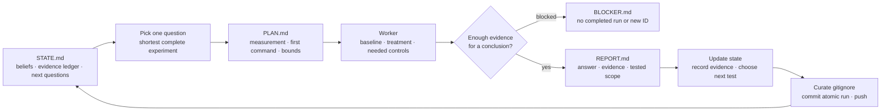

# delta-research

**An autonomous research loop for any agent.** Drop into your project. The agent picks hypotheses, designs experiments, runs them, and updates its beliefs — until it answers your research question or hits a budget.

**Compatible with what you already have.** No rewrites, no new infra. Works on top of your existing scripts and however you already submit jobs.

**Human steers, agent experiments.** You own the hypotheses and direction. The agent takes the shortest path to a
measurement: it designs runs, writes scripts, debugs failures, and updates the belief table. Reading, audits, and
setup do not masquerade as research progress.

**Hands-off execution.** The agent monitors experiments, uses available GPUs, runs a small risk check only when a
specific failure could waste a costly run, and recovers from common failures. You read `SYNTHESIS.md` when you want
to check in.

**Shortest wall-clock GPU execution.** You confirm how many GPUs a run may use. The worker gives useful work to all
of them, defaults to DDP when one model replica fits per GPU, and uses tensor/model sharding only when the model or
operation cannot run independently per GPU.



```mermaid
flowchart LR
    S[STATE.md<br/>beliefs · evidence ledger · next questions] --> P[Pick one question<br/>shortest complete experiment]
    P --> PL[PLAN.md<br/>measurement · first command · bounds]
    PL --> W[Worker<br/>baseline · treatment · needed controls]
    W --> D{Enough evidence<br/>for a conclusion?}
    D -- blocked --> B[BLOCKER.md<br/>no completed run or new ID]
    D -- yes --> R[REPORT.md<br/>answer · evidence · tested scope]
    R --> C[Update state<br/>record evidence · choose next test]
    C --> V[Curate gitignore<br/>commit atomic run · push]
    V --> S
```

---

## Recent updates

- **SLURM support** — generate `experiment.py` + `job.sh`, submit, monitor
- **wandb integration** — live metrics + optional requested Reports
- **Observability framework** — DELTA markers, dense logs, run directories
- **INFRA profile** — hardware + cluster config + optimization playbook
- **Smoke tests** — fast-queue dry run before hero run
- **Cluster probe + interview** — partitions, storage policy, fairshare
- **Persistent CLAUDE.md/AGENTS.md rules** — loop discipline survives compaction
- **Predictions in plans** — predicted vs actual in reports. Good for your brain's on-policy learning!
- **Lightweight working plans** — one editable `PLAN.md`, normally ≤5 minutes and always ≤10 minutes to write;
  workers adapt it directly without immutable copies, amendment classes, or approval gates
- **Minimum decisive experiments** — scientific adequacy is a hard floor; among tests that can support or
  contradict the hypothesis, run the one with the shortest total time to result and stop when the floor is met
- **All confirmed GPUs do useful work** — optimize wall-clock time, default to DDP when a replica fits, and reserve
  tensor/model parallelism for a concrete memory or indivisible-operation constraint
- **One run, one coherent answer** — baseline, treatment, repetitions, necessary controls, and verdict-changing
  ablations share one R###; setup, retries, individual conditions, and plots never become separate runs
- **Paper-like reports** — Answer, Motivation, Questions tested, Method, Experiments, Results, Analysis, optional
  Ablations, Limitations, Conclusion, and Reproducibility
- **Plain-English technical reports** — lead with the answer and decisive number, explain what it means, preserve
  exact technical details, define unfamiliar terms, and keep loop-internal jargon out of human-facing summaries
- **Evidence-first progress contract** — direct experiments outrank all support work; standalone literature
  reviews, experiment surveys, audits, gates, cleanup, and refactors do not consume research runs
- **No setup-run spam** — necessary setup is bounded work inside the selected experiment; if it cannot be repaired,
  the loop records a blocker without writing a research report, incrementing the run count, or consuming another ID
- **One-shot direction recovery** — scientific literature search is forbidden while an experiment is available;
  after direct work fails and project evidence yields no direction, one bounded recovery search must produce an
  executable experiment or stop at `AMBIGUITY`
- **Atomic GitHub publication** — after compression, each run is explicitly staged, committed on a research
  branch, pushed, and verified before the next cycle starts
- **Reference repo discovery** — reuse existing scaffolds, don't rebuild

---

## Quickstart

```bash
# 1. Clone delta-research into your project
cd your-project
git clone https://github.com/user074/delta-research.git ./delta-research

# 2. Activate your env, then start your agent
#    (use whichever env manager your project uses)
conda activate your-env            # conda / mamba
# source .venv/bin/activate        # uv / plain venv
# uv venv && source .venv/bin/activate  # uv from scratch
claude --dangerously-skip-permissions  # or: codex --approve-for-me
```

In the agent, send these two prompts:

```
Initialize delta-research
```

The agent reads `delta-research/templates/INIT.md`, interviews you about your research question, hypotheses, and constraints, profiles your hardware, and seeds `STATE.md`. On clusters, it interviews you about partitions and storage policy, then validates with a test SLURM job.

```
Run the research loop
```

The loop runs autonomously until it hits a budget, blocker, or asks you something. Read `SYNTHESIS.md` whenever you want to check in.

> **Codex users:** enable multi-agent once with `codex features enable multi_agent`. Then `codex --approve-for-me` from the project root.

---

## What you get

| File | Contents | When to read |
|------|----------|--------------|
| `SYNTHESIS.md` | Answer, best evidence, tested scope, and next step only if needed | **Start here** |
| `STATE.md` | Belief table with confidences, run ledger, experiment frontier | When you want exact numbers |
| `REPORTS/R###.md` | Per-run result — answer first, then method, inline data, tested scope, and verdict | Drilling into a result |
| `RUNS/R###/` | Editable working plan, logs, metrics, checkpoints, artifacts, scripts | Raw data and execution record |
| wandb dashboard | Live training metrics + cumulative versioned Reports | While experiments are running |

---

## Why use this

What's better than hands-off 72 hours and let agent do its thing? 

|  | Notebook | MLflow / W&B | AutoML / sweep | **delta-research** |
|---|---|---|---|---|
| Picks what to test next | you | you | within param grid | **agent** |
| Tracks experiments | manual | yes | yes | yes |
| Updates beliefs from results | in your head | no | implicit | **explicit, with confidence** |
| Handles paradigm shifts | you reframe | no | no | **dependent beliefs flagged** |
| Designs the experiment | you | you | within search space | **agent** |
| Use it when | one-off analysis | you know what to test | optimizing a known objective | **open research question** |

---

## How it works

Each cycle runs one experiment: *what changed → what happened → what it means*. The loop has 7 phases:

1. **Read** STATE.md (current beliefs, ledger, frontier)
2. **Select the minimum complete experiment** — choose one hypothesis question and the fastest package that can
   answer it
3. **Sketch** the experiment — name the main comparison, complete evidence needed, first command, resources, and bounds
4. **Spawn** a worker to execute (direct shell or SLURM sbatch)
5. **Ingest** the worker's REPORT.md
6. **Compress + publish** — update belief confidences, append ledger, refresh frontier, then curate `.gitignore`,
   commit the atomic run, push its research branch, and verify the remote
7. **Loop** back to step 1

The loop stops on interrupt boundaries: `GOAL`, `BUDGET`, `NULL_STREAK`, `STALL`, `BLOCKER`, `AMBIGUITY`, or
`IRREVERSIBLE`. `GOAL` fires when the target hypothesis has adequate supporting or contradicting evidence in its
tested scope and no explicitly requested question remains.

**Hypotheses over experiments.** The belief table is the real output. Experiments are tools to push beliefs toward supported or rejected.

**Fast enough, rigorous enough.** First require a test whose comparison, metric, minimum replication, and only
essential control can credibly land on either side of the hypothesis fork. Among such tests, minimize total time:
setup, queue, execution, and analysis. Run the highest-signal condition first and stop when the minimum evidence
needed for a credible answer has been collected.
Do not add configurations, repetitions, controls, plots, or mechanism analysis just to make a valid result look
more complete. Add a control or ablation only when the current evidence cannot answer the question or an alternative
could reverse the conclusion; otherwise stop.

**Use the confirmed GPUs for speed.** The detected GPU count is not permission: the human confirms `N`. Once
confirmed, each GPU experiment allocates all `N` and assigns every GPU useful samples, batches, or independent
conditions. When a full model replica fits on one GPU, use DDP (`torchrun --nproc_per_node=N`) rather than tensor
parallelism. Tensor/model sharding is a fallback for a concrete single-GPU memory or indivisible-operation limit.
Record launch-to-result wall-clock time, throughput, and per-rank work counts inside the experiment—not as a new
audit, gate, or run.

**Evidence before activity.** A direct run must state the exact measurement it will produce and how either
outcome changes a belief. Generic literature review, comparing possible experiments, audits, gates, cleanup,
refactors, and infrastructure polishing are not runs. A targeted technical-documentation lookup may resolve a
specific API or execution unknown; it is time-boxed and stays inside the same experiment.

**Explain it so a technical colleague understands it immediately.** Reports and `SYNTHESIS.md` start with whether
the evidence supports, contradicts, or cannot yet decide the hypothesis. They give the decisive number, explain its
meaning in plain English, state the exact model/data/metric/runtime when relevant, and name only a limitation that
could change the answer. Unfamiliar technical terms are defined on first use. Internal loop labels, invented
acronyms, management language, and process narration stay out of the opening summary.

**Literature only after direction failure.** The loop may search scientific literature only after a direct attempt
fails or exhausts its direction, the Frontier is empty, and STATE/reports/project artifacts cannot produce another
experiment. Recovery is limited to one 30-minute search over at most 8 relevant primary/official sources. It must
yield an executable direct experiment immediately or stop at `AMBIGUITY`; another literature search is forbidden
until new direct evidence exists. Literature never gates an experiment or changes belief confidence by itself.

**One run is one coherent answer.** Keep the baseline, treatment, repetitions, necessary controls, and any
verdict-changing ablations together. Setup, data conversion, smoke checks, debugging, retries, individual seeds or
conditions, plots, and analysis are stages of that run—not new runs. If bounded repair cannot reach the experiment,
write `BLOCKER.md` and pause without a research report, Ledger row, incremented run count, or new run ID.

Substantial does not mean artificially large. A five-minute benchmark is a valid run when it alone answers the
question. A single baseline or ablation is not a valid completed run when the conclusion requires more conditions.

**Wrong is fine, stuck is not.** Rejecting a hypothesis is as valuable as confirming one. When a core belief is rejected (confidence drops ≥ 0.3), dependent beliefs are flagged for re-evaluation and the frontier is adjusted.

**Plans guide work; they do not gate it.** A run has one editable `PLAN.md`. Planning normally takes no more than
5 minutes, has a hard 10-minute/400-word cap, and ends as soon as the question, complete evidence package, first
command, required resources, and real bounds are clear. Workers change commands, paths, resources, compute, and analyses
directly without approval or amendment bookkeeping. Only material scientific changes made after outcomes are
visible get a one-sentence note; affected results are then labeled exploratory rather than hidden or rewritten.

**A decided hypothesis ends the loop.** Do not invent mechanism studies, broader benchmarks, or new beliefs merely
to keep cycling. Preserve optional follow-ups as notes and return the result once the human's stated question is
adequately supported or contradicted in the declared scope.

**Smoke only for a concrete risk, then keep going.** A smoke test is optional, limited to 10% of the run budget,
and justified only when it reduces a specific costly-run failure risk. Smoke and measurement share one R###; a
passing smoke test is not a completed research run or a general gate.

---

## SLURM clusters

The framework is cluster-aware out of the box. On SLURM:

- **Init interviews you** about partitions, storage policy (`/mnt/home` vs `/mnt/lustre` matters — defaults are wrong on most clusters), accounts, QOS, fairshare conventions
- **Validates with a test job** before committing to real runs (env activation, GPU access, NCCL, dataset paths mounted on compute nodes)
- **Workers generate self-contained `experiment.py` + `job.sh`**, submit via `sbatch`, monitor via `scripts/wait_for_job.sh` (FIFO-based, no polling)
- **DELTA marker protocol** for sparse automation signals; full logs to `RUNS/R###/logs/`; live metrics to wandb
- **All paths are absolute**, anchored to a project-root field in `INFRA.md` so jobs work regardless of compute-node CWD

See `templates/OBSERVABILITY.md` for the full execution workflow and `templates/INFRA.template.md` for the cluster profile.

---

## Works with

- **Claude Code** — `claude` CLI, uses Task tool for worker spawning
- **OpenAI Codex** — `codex --approve-for-me`, requires `codex features enable multi_agent`
- **Cursor** and any other agent that reads markdown and runs commands

---

## What's in the box

```
delta-research/
├── templates/
│   ├── INIT.md              # First-time setup (interview, env, hardware, SLURM)
│   ├── SUPERVISOR.md        # The 7-phase loop spec, worker prompt template
│   ├── OBSERVABILITY.md     # DELTA markers, run logging, SLURM workflow
│   ├── WANDB_REPORTS.md     # wandb Report sub-agent spec
│   ├── INFRA.template.md    # Hardware + cluster profile
│   ├── STATE.template.md
│   ├── PLAN.template.md
│   ├── REPORT.template.md
│   ├── BLOCKER.template.md  # Pending execution note; never counts as a completed run
│   ├── LITERATURE.template.md  # Optional human-requested or one-shot recovery brief
│   ├── LITERATURE_INDEX.template.md  # Optional bounded-review registry
│   └── SYNTHESIS.template.md
├── scripts/
│   └── wait_for_job.sh      # Universal SLURM monitor (FIFO + 30s safety net)
└── tests/
    └── run_tests.py         # Structural + LLM-review tests for all artifacts
```

---

## Testing

```bash
# Validate existing outputs (no agent, fast)
python tests/run_tests.py

# Generate outputs by running the agent, then validate
python tests/run_tests.py --run

# LLM review — agent evaluates output quality against templates
python tests/run_tests.py --run --review

# Single test
python tests/run_tests.py --run --test plan
python tests/run_tests.py --run --test slurm

# Use Codex instead of Claude
python tests/run_tests.py --run --agent codex
```

After editing templates, re-run `--run --review` to verify the agent follows the updated rules.

---

## Updating

```bash
cd your-project/delta-research
git pull
```

Existing `STATE.md`, `INFRA.md`, `SYNTHESIS.md`, `REPORTS/`, `LITERATURE/`, and `RUNS/` are untouched — they live in your project root, not in `delta-research/`.

---

## Feedback

Bugs, feature requests, and questions: [github.com/user074/delta-research/issues](https://github.com/user074/delta-research/issues).

If the agent finds something unclear, broken, or missing while running the loop, it should suggest you open an issue with a snippet of the failure or confusion — that's the fastest way to get it fixed.

---

## License

MIT
