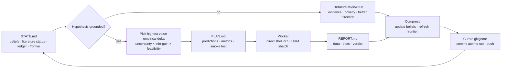

# delta-research

**An autonomous research loop for any agent.** Drop into your project. The agent picks hypotheses, designs experiments, runs them, and updates its beliefs — until it answers your research question or hits a budget.

**Compatible with what you already have.** No rewrites, no new infra. Works on top of your existing scripts and however you already submit jobs.

**Human steers, agent codes.** You own the hypotheses and the direction. The agent grounds every hypothesis in a
dedicated literature-review round, then designs runs, writes scripts, debugs failures, and updates the belief
table. You stay in flow — less coding, more thinking.

**Hands-off execution.** The agent monitors experiments, parallelizes GPU utilization, smoke-tests before hero runs, and recovers from common failures. You read `SYNTHESIS.md` when you want to check in.



```mermaid
flowchart LR
    S[STATE.md<br/>beliefs · literature status · ledger · frontier] --> G{Hypothesis grounded?}
    G -- no --> L[Literature-review run<br/>evidence · novelty · better direction]
    L --> C
    G -- yes --> P[Pick highest-value empirical delta<br/>uncertainty × info-gain × feasibility]
    P --> PL[PLAN.md<br/>predictions · metrics · smoke test]
    PL --> W[Worker<br/>direct shell or SLURM sbatch]
    W --> R[REPORT.md<br/>data · plots · verdict]
    R --> C[Compress<br/>update beliefs · refresh frontier]
    C --> V[Curate gitignore<br/>commit atomic run · push]
    V --> S
```

---

## Recent updates

- **SLURM support** — generate `experiment.py` + `job.sh`, submit, monitor
- **wandb integration** — live metrics + versioned cumulative Reports
- **Observability framework** — DELTA markers, dense logs, run directories
- **INFRA profile** — hardware + cluster config + optimization playbook
- **Smoke tests** — fast-queue dry run before hero run
- **Cluster probe + interview** — partitions, storage policy, fairshare
- **Persistent CLAUDE.md/AGENTS.md rules** — loop discipline survives compaction
- **Predictions in plans** — predicted vs actual in reports. Good for your brain's on-policy learning!
- **Literature Grounding Gate** — every seed and future hypothesis gets its own primary-source review before an
  empirical run may target it
- **Atomic GitHub publication** — after compression, each run is explicitly staged, committed on a research
  branch, pushed, and verified before the next cycle starts
- **Reference repo discovery** — reuse existing scaffolds, don't rebuild

---

## Quickstart

```bash
# 1. Clone delta-research into your project
cd your-project
git clone https://github.com/user074/delta-research.git ./delta-research

# 2. Activate your env, then start your agent
#    (use whichever env manager your project uses)
conda activate your-env            # conda / mamba
# source .venv/bin/activate        # uv / plain venv
# uv venv && source .venv/bin/activate  # uv from scratch
claude --dangerously-skip-permissions  # or: codex --yolo
```

In the agent, send these two prompts:

```
Initialize delta-research
```

The agent reads `delta-research/templates/INIT.md`, interviews you about your research question, hypotheses, and constraints, profiles your hardware, and seeds `STATE.md`. On clusters, it interviews you about partitions and storage policy, then validates with a test SLURM job.

```
Run the research loop
```

The loop runs autonomously until it hits a budget, blocker, or asks you something. Read `SYNTHESIS.md` whenever you want to check in.

> **Codex users:** enable multi-agent once with `codex features enable multi_agent`. Then `codex --full-auto` from the project root.

---

## What you get

| File | Contents | When to read |
|------|----------|--------------|
| `SYNTHESIS.md` | Plain-language summary: current beliefs, recent findings, what's next | **Start here** |
| `STATE.md` | Belief table with confidences, run ledger, experiment frontier | When you want exact numbers |
| `REPORTS/R###.md` | Per-run experimental or literature review — evidence, method/data, verdict | Drilling into a result |
| `LITERATURE/INDEX.md` | Per-belief grounding registry with current verdict/direction and archive links | Reviewing prior work and novelty |
| `LITERATURE/B###/R###/` | Immutable full review, query log, evidence matrix, bibliography | Auditing or refreshing a review |
| `RUNS/R###/` | Plan, logs, metrics, checkpoints, artifacts, scripts | Raw data |
| wandb dashboard | Live training metrics + cumulative versioned Reports | While experiments are running |

---

## Why use this

What's better than hands-off 72 hours and let agent do its thing? 

|  | Notebook | MLflow / W&B | AutoML / sweep | **delta-research** |
|---|---|---|---|---|
| Picks what to test next | you | you | within param grid | **agent** |
| Tracks experiments | manual | yes | yes | yes |
| Updates beliefs from results | in your head | no | implicit | **explicit, with confidence** |
| Handles paradigm shifts | you reframe | no | no | **dependent beliefs flagged** |
| Designs the experiment | you | you | within search space | **agent** |
| Use it when | one-off analysis | you know what to test | optimizing a known objective | **open research question** |

---

## How it works

A "delta" is one experiment: *what changed → what happened → what it means*. The loop has 7 phases:

1. **Read** STATE.md (current beliefs, ledger, frontier)
2. **Ground + select** — if the target hypothesis is ungrounded, run its dedicated literature review first;
   otherwise select the highest-value empirical delta (uncertainty × info-gain × feasibility)
3. **Plan** the experiment — including predictions, success metrics, and a smoke test
4. **Spawn** a worker to execute (direct shell or SLURM sbatch)
5. **Ingest** the worker's REPORT.md
6. **Compress + publish** — update belief confidences, append ledger, refresh frontier, then curate `.gitignore`,
   commit the atomic run, push its research branch, and verify the remote
7. **Loop** back to step 1

The loop stops only on interrupt boundaries: `BUDGET`, `NULL_STREAK`, `BLOCKER`, `AMBIGUITY`, or `IRREVERSIBLE`. Otherwise it keeps cycling.

**Hypotheses over experiments.** The belief table is the real output. Experiments are tools to push beliefs toward supported or rejected.

**Ground before testing.** Every hypothesis begins with Literature `pending`. A one-hypothesis review searches
current primary work, contrary/null evidence, closest prior art, reusable code/data/methods, and better directions.
Only a grounded hypothesis is eligible for empirical testing. New hypotheses discovered mid-loop follow the same
rule, so the loop cannot silently drift into an ungrounded direction.

**Wrong is fine, stuck is not.** Rejecting a hypothesis is as valuable as confirming one. When a core belief is rejected (confidence drops ≥ 0.3), dependent beliefs are flagged for re-evaluation and the frontier is adjusted.

**Smoke test first.** For non-trivial runs, the worker submits a 5-15 minute smoke test on the fast-queue partition before committing GPU-hours to the hero run. Catches OOM, missing paths, walltime underestimates, and precision bugs.

---

## SLURM clusters

The framework is cluster-aware out of the box. On SLURM:

- **Init interviews you** about partitions, storage policy (`/mnt/home` vs `/mnt/lustre` matters — defaults are wrong on most clusters), accounts, QOS, fairshare conventions
- **Validates with a test job** before committing to real runs (env activation, GPU access, NCCL, dataset paths mounted on compute nodes)
- **Workers generate self-contained `experiment.py` + `job.sh`**, submit via `sbatch`, monitor via `scripts/wait_for_job.sh` (FIFO-based, no polling)
- **DELTA marker protocol** for sparse automation signals; full logs to `RUNS/R###/logs/`; live metrics to wandb
- **All paths are absolute**, anchored to a project-root field in `INFRA.md` so jobs work regardless of compute-node CWD

See `templates/OBSERVABILITY.md` for the full execution workflow and `templates/INFRA.template.md` for the cluster profile.

---

## Works with

- **Claude Code** — `claude` CLI, uses Task tool for worker spawning
- **OpenAI Codex** — `codex --full-auto`, requires `codex features enable multi_agent`
- **Cursor** and any other agent that reads markdown and runs commands

---

## What's in the box

```
delta-research/
├── templates/
│   ├── INIT.md              # First-time setup (interview, env, hardware, SLURM)
│   ├── SUPERVISOR.md        # The 7-phase loop spec, worker prompt template
│   ├── OBSERVABILITY.md     # DELTA markers, run logging, SLURM workflow
│   ├── WANDB_REPORTS.md     # wandb Report sub-agent spec
│   ├── INFRA.template.md    # Hardware + cluster profile
│   ├── STATE.template.md
│   ├── PLAN.template.md
│   ├── REPORT.template.md
│   ├── LITERATURE.template.md  # One-hypothesis grounding review contract
│   ├── LITERATURE_INDEX.template.md
│   └── SYNTHESIS.template.md
├── scripts/
│   └── wait_for_job.sh      # Universal SLURM monitor (FIFO + 30s safety net)
└── tests/
    └── run_tests.py         # Structural + LLM-review tests for all artifacts
```

---

## Testing

```bash
# Validate existing outputs (no agent, fast)
python tests/run_tests.py

# Generate outputs by running the agent, then validate
python tests/run_tests.py --run

# LLM review — agent evaluates output quality against templates
python tests/run_tests.py --run --review

# Single test
python tests/run_tests.py --run --test plan
python tests/run_tests.py --run --test slurm

# Use Codex instead of Claude
python tests/run_tests.py --run --agent codex
```

After editing templates, re-run `--run --review` to verify the agent follows the updated rules.

---

## Updating

```bash
cd your-project/delta-research
git pull
```

Existing `STATE.md`, `INFRA.md`, `SYNTHESIS.md`, `REPORTS/`, `LITERATURE/`, and `RUNS/` are untouched — they live in your project root, not in `delta-research/`.

---

## Feedback

Bugs, feature requests, and questions: [github.com/user074/delta-research/issues](https://github.com/user074/delta-research/issues).

If the agent finds something unclear, broken, or missing while running the loop, it should suggest you open an issue with a snippet of the failure or confusion — that's the fastest way to get it fixed.

---

## License

MIT
