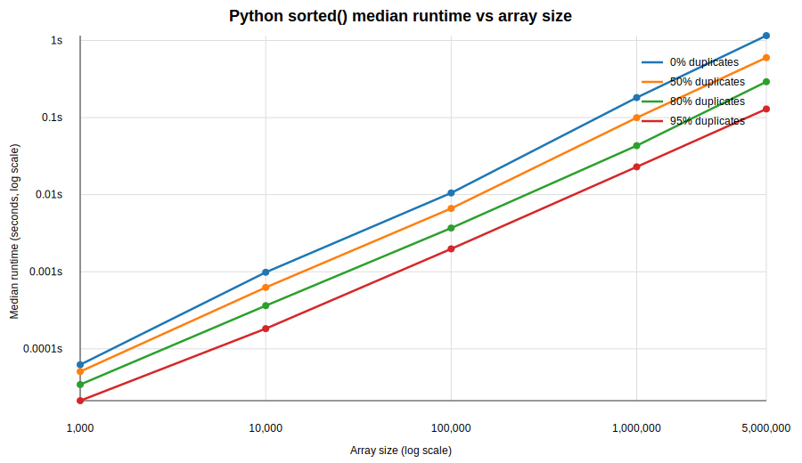
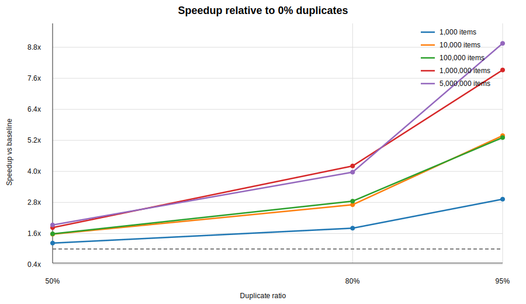

# REPORT — R003

## Summary
I benchmarked Python's `sorted()` on synthetic float arrays from 1,000 to 5,000,000 elements with 0%, 50%, 80%, and 95% duplicates. Duplicate-heavy inputs sorted faster at every tested size, with the key checkpoint at 1,000,000 elements showing a `7.92x` speedup at 95% duplicates versus the fully random baseline. This strongly supports belief #3's empirical claim that duplicate-heavy distributions reduce sort time, although the mechanism remains somewhat confounded.

## Motivation
This run tested belief #3: duplicate-heavy distributions reduce sorting time due to equal-element optimizations. The plan defined support as a speedup above `1.2x` at 95% duplicates for 1,000,000 elements, and contradiction as staying below `1.05x` across ratios. A strong positive result would establish that repeated values are a major source of structure that Python's sort can exploit.

## Method
Using Python 3.10.10, I generated synthetic arrays inline with `random.seed(42)` and exact duplicate ratios of `0%`, `50%`, `80%`, and `95%`. For each size in `[1_000, 10_000, 100_000, 1_000_000, 5_000_000]`, I filled the duplicate fraction with `42.0`, filled the remainder with uniform random floats, shuffled the list, and timed `sorted(array)` for 5 repetitions with `time.perf_counter()`.

For each `(size, duplicate_ratio)` pair, I recorded median, min, max, and max/min variance ratio, then computed speedup relative to the same-size `0%` duplicate baseline. To probe the confound suggested in the plan, I also benchmarked `list.sort()` at 1,000,000 elements for `0%` and `95%` duplicates, again with 5 repetitions, and compared the resulting speedups.

## Results

### Data
| Size | Duplicate ratio | Median `sorted()` (s) | Min (s) | Max (s) | Max/Min | Speedup vs 0% |
|--------|-------:|-------:|-------:|-------:|-------:|-------:|
| 1,000 | 0% | 0.000062 | 0.000057 | 0.000082 | 1.45 | 1.00x |
| 1,000 | 50% | 0.000051 | 0.000044 | 0.000065 | 1.47 | 1.23x |
| 1,000 | 80% | 0.000035 | 0.000030 | 0.000040 | 1.34 | 1.81x |
| 1,000 | 95% | 0.000021 | 0.000020 | 0.000024 | 1.19 | 2.93x |
| 10,000 | 0% | 0.000986 | 0.000939 | 0.001078 | 1.15 | 1.00x |
| 10,000 | 50% | 0.000627 | 0.000622 | 0.000693 | 1.11 | 1.57x |
| 10,000 | 80% | 0.000363 | 0.000356 | 0.000434 | 1.22 | 2.71x |
| 10,000 | 95% | 0.000183 | 0.000177 | 0.000256 | 1.45 | 5.38x |
| 100,000 | 0% | 0.010518 | 0.010279 | 0.010625 | 1.03 | 1.00x |
| 100,000 | 50% | 0.006633 | 0.006506 | 0.007478 | 1.15 | 1.59x |
| 100,000 | 80% | 0.003692 | 0.003594 | 0.004085 | 1.14 | 2.85x |
| 100,000 | 95% | 0.001981 | 0.001904 | 0.002153 | 1.13 | 5.31x |
| 1,000,000 | 0% | 0.181856 | 0.169469 | 0.230848 | 1.36 | 1.00x |
| 1,000,000 | 50% | 0.099566 | 0.090071 | 0.104925 | 1.16 | 1.83x |
| 1,000,000 | 80% | 0.043185 | 0.041033 | 0.047518 | 1.16 | 4.21x |
| 1,000,000 | 95% | 0.022954 | 0.021585 | 0.025514 | 1.18 | 7.92x |
| 5,000,000 | 0% | 1.156538 | 1.147664 | 1.162696 | 1.01 | 1.00x |
| 5,000,000 | 50% | 0.599359 | 0.596923 | 0.676301 | 1.13 | 1.93x |
| 5,000,000 | 80% | 0.291321 | 0.284090 | 0.330064 | 1.16 | 3.97x |
| 5,000,000 | 95% | 0.129179 | 0.120082 | 0.132857 | 1.11 | 8.95x |

| Confound check at 1,000,000 elements | Value | Notes |
|--------|-------:|-------|
| `sorted()` median at 0% duplicates | 0.176132 s | Baseline for confound check |
| `sorted()` median at 95% duplicates | 0.022785 s | `7.73x` faster than 0% |
| `list.sort()` median at 0% duplicates | 0.165157 s | In-place sort baseline |
| `list.sort()` median at 95% duplicates | 0.020127 s | `8.21x` faster than 0% |
| Largest observed speedup | 8.95x | `sorted()`, 5,000,000 elements, 95% duplicates |
| Smallest observed speedup above baseline | 1.23x | `sorted()`, 1,000 elements, 50% duplicates |
| Stop-condition violations | 0 | No run exceeded 5 minutes; no variance ratio exceeded 5x |

### Visualizations

### Analysis
The effect is monotonic in both duplicate ratio and array size. At every size, more duplicates produced lower median runtime, and the improvement accelerated sharply between `80%` and `95%` duplicates. The plan's main decision threshold was crossed by a wide margin: at 1,000,000 elements and 95% duplicates, the measured speedup was `7.92x`, not merely above `1.2x`.

The confound check shows the speedup is not unique to the `sorted()` wrapper. `sorted()` and `list.sort()` both improved by roughly eightfold at 95% duplicates on 1,000,000 elements, which is consistent with repeated-key structure making comparisons or merges much cheaper for Python's underlying Timsort implementation. That supports the existence of a real duplicate-driven effect, but it does not isolate whether the mechanism is specifically "equal-element optimizations" versus a broader reduction in comparison work caused by repeated keys.

## Signal
- **discrimination**: discriminating
- The result clearly separates belief #3 from the null case because the observed speedups are far above the plan's support threshold and appear at every tested scale.
- The strongest single observation is `7.92x` speedup at 1,000,000 elements and `8.95x` at 5,000,000 elements for 95% duplicates.

## Verdict
**supports** — belief #3: duplicate-heavy distributions do reduce Python sort time by a large margin on this benchmark, though the exact causal mechanism remains partially confounded.

## Confounds
- `sorted()` and `list.sort()` share the same underlying sort implementation in CPython, so this check does not cleanly distinguish wrapper effects from algorithm-level behavior.
- Replacing many random values with the constant `42.0` changes both duplicate rate and comparison structure, so the benchmark cannot separate repeated-key effects from any cache or memory-locality changes induced by a narrower value distribution.
- The arrays contain only floats; the magnitude of the effect could differ for richer Python objects with more expensive comparison semantics.

## New hypotheses
- Repeated keys primarily reduce comparison work inside Timsort, and any equal-element-specific fast path is secondary. [parent: #3]
- The duplicate-driven speedup grows with `N` because repeated-key runs create merge patterns that become disproportionately favorable at larger scales. [parent: #3]
- For custom Python objects with expensive `__lt__`, duplicate-heavy inputs will produce an even larger speedup than floats. [parent: #3]

## Next tests
1. Instrument comparison counts with a custom comparable object to test whether duplicate-heavy inputs reduce the number of `__lt__` calls enough to explain the runtime drop.
2. Compare CPython `sorted()` against an alternative implementation such as `numpy.sort()` or a pure-Python merge/quicksort baseline on the same duplicated workloads to isolate Timsort-specific behavior.
3. Hold the value range fixed while varying only duplicate placement or run structure to distinguish repeated-key effects from general data-layout or cache effects.

## Artifacts
- `artifacts/median_sort_time_vs_size.svg` — log-log plot of median `sorted()` runtime versus array size for each duplicate ratio.
- `artifacts/speedup_vs_duplicate_ratio.svg` — speedup versus duplicate ratio for each tested array size.

## Meta
- **run_id**: R003
- **delta**: Benchmark Python `sorted()` on synthetic arrays with duplicate ratios of 0%, 50%, 80%, and 95% across sizes 1,000 to 5,000,000.
- **started**: 2026-03-07 18:06:57 -0500
- **completed**: 2026-03-07 18:07:21 -0500
- **status**: completed
