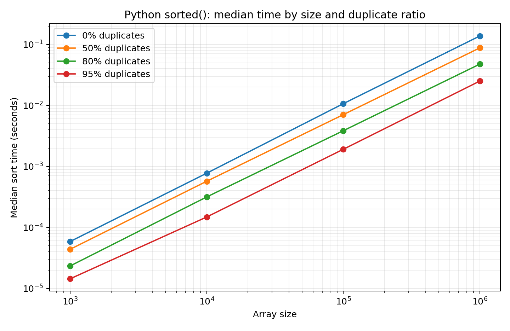

# REPORT — R003: Do duplicate-heavy inputs reduce Python sorting time?

## Answer

The result supports the hypothesis for this Python setup: at 1,000,000 elements, 95% duplicates cut median `sorted()` time from 137.889 ms to 25.147 ms, a 5.48× speedup. This exceeds the 1.2× support threshold, but the experiment does not identify which part of Timsort caused the gain.

## Motivation

This experiment tested belief #3 (prior confidence 0.45): duplicate-heavy distributions reduce Python sorting time. A speedup above 1.2× at 95% duplicates and 1,000,000 elements would support the belief; speedups below 1.05× across all ratios would contradict it.

## Questions tested

1. **Primary:** Does increasing duplicate ratio reduce `sorted()` time, with >1.2× speedup at 1M/95% supporting belief #3 and <1.05× across ratios contradicting it?
2. **Secondary:** Does `list.sort()` show the same direction, ruling out a difference unique to the `sorted()` wrapper?

## Method

- **approach:** Vary only duplicate ratio, then time Python sorting.
- **data:** NumPy `RandomState(42)` random floats at 1K, 10K, 100K, and 1M elements; replace 0%, 50%, 80%, or 95% of positions with `42.0`.
- **comparisons:** Each duplicate-heavy condition versus its same-size 0% baseline; `list.sort()` repeats the full grid as a control.
- **metrics:** Median runtime, max/min spread, and baseline median divided by condition median; >1.2× at 1M/95% supports.
- **repetitions:** Three single-operation `timeit` repetitions per condition.
- **environment:** CPython 3.10.13, NumPy 1.26.2, arm64 macOS.
- **parallel execution:** CPU-only, one timing process; GPU count N/A.
- **scientific changes during execution:** None.

## Experiments

| Experiment | Why it is needed | Comparison / conditions |
|------------|------------------|-------------------------|
| Main `sorted()` grid | Directly tests the duplicate-ratio hypothesis | 4 sizes × 4 duplicate ratios × 3 repetitions |
| `list.sort()` control | Checks whether the direction is unique to the `sorted()` wrapper | Same 4 × 4 × 3 grid |

## Results

### Data

All times are milliseconds. Variance ratio is maximum divided by minimum; speedup is relative to the same implementation and size at 0% duplicates.

| Implementation | Size | Duplicates | Min (ms) | Median (ms) | Max (ms) | Max/min | Speedup |
|---|---:|---:|---:|---:|---:|---:|---:|
| `sorted()` | 1,000 | 0% | 0.049958 | 0.058708 | 0.075167 | 1.505 | 1.000× |
| `sorted()` | 1,000 | 50% | 0.035583 | 0.043792 | 0.067625 | 1.900 | 1.341× |
| `sorted()` | 1,000 | 80% | 0.021792 | 0.023334 | 0.033208 | 1.524 | 2.516× |
| `sorted()` | 1,000 | 95% | 0.013792 | 0.014375 | 0.018833 | 1.365 | 4.084× |
| `sorted()` | 10,000 | 0% | 0.764958 | 0.774375 | 1.052541 | 1.376 | 1.000× |
| `sorted()` | 10,000 | 50% | 0.526209 | 0.571167 | 0.918875 | 1.746 | 1.356× |
| `sorted()` | 10,000 | 80% | 0.307083 | 0.316041 | 0.396834 | 1.292 | 2.450× |
| `sorted()` | 10,000 | 95% | 0.147542 | 0.148250 | 0.181500 | 1.230 | 5.223× |
| `sorted()` | 100,000 | 0% | 10.573083 | 10.689625 | 10.720042 | 1.014 | 1.000× |
| `sorted()` | 100,000 | 50% | 6.854208 | 7.065334 | 7.156792 | 1.044 | 1.513× |
| `sorted()` | 100,000 | 80% | 3.769750 | 3.851167 | 4.495625 | 1.193 | 2.776× |
| `sorted()` | 100,000 | 95% | 1.793916 | 1.911084 | 2.174000 | 1.212 | 5.593× |
| `sorted()` | 1,000,000 | 0% | 135.140500 | 137.889250 | 138.012583 | 1.021 | 1.000× |
| `sorted()` | 1,000,000 | 50% | 87.469833 | 87.979042 | 89.162209 | 1.019 | 1.567× |
| `sorted()` | 1,000,000 | 80% | 44.425416 | 47.670583 | 47.855625 | 1.077 | 2.893× |
| `sorted()` | 1,000,000 | 95% | 24.785083 | 25.146583 | 26.988875 | 1.089 | 5.483× |
| `list.sort()` | 1,000 | 0% | 0.052042 | 0.059000 | 0.091833 | 1.765 | 1.000× |
| `list.sort()` | 1,000 | 50% | 0.036125 | 0.038875 | 0.045292 | 1.254 | 1.518× |
| `list.sort()` | 1,000 | 80% | 0.022750 | 0.023625 | 0.027542 | 1.211 | 2.497× |
| `list.sort()` | 1,000 | 95% | 0.013542 | 0.014167 | 0.016792 | 1.240 | 4.165× |
| `list.sort()` | 10,000 | 0% | 0.771958 | 0.784750 | 0.799750 | 1.036 | 1.000× |
| `list.sort()` | 10,000 | 50% | 0.521333 | 0.538958 | 0.564917 | 1.084 | 1.456× |
| `list.sort()` | 10,000 | 80% | 0.285500 | 0.302666 | 0.323167 | 1.132 | 2.593× |
| `list.sort()` | 10,000 | 95% | 0.139792 | 0.153625 | 0.163125 | 1.167 | 5.108× |
| `list.sort()` | 100,000 | 0% | 10.422542 | 10.441917 | 10.714500 | 1.028 | 1.000× |
| `list.sort()` | 100,000 | 50% | 6.541167 | 6.562708 | 6.614583 | 1.011 | 1.591× |
| `list.sort()` | 100,000 | 80% | 3.778750 | 3.797625 | 3.892042 | 1.030 | 2.750× |
| `list.sort()` | 100,000 | 95% | 1.845667 | 1.884708 | 1.892792 | 1.026 | 5.540× |
| `list.sort()` | 1,000,000 | 0% | 133.662250 | 136.155708 | 140.348500 | 1.050 | 1.000× |
| `list.sort()` | 1,000,000 | 50% | 84.039750 | 84.901250 | 85.397500 | 1.016 | 1.604× |
| `list.sort()` | 1,000,000 | 80% | 43.758416 | 45.127584 | 89.720833 | 2.050 | 3.017× |
| `list.sort()` | 1,000,000 | 95% | 33.527083 | 68.768875 | 152.016917 | 4.534 | 1.980× |

The primary decision metrics were:

| Metric | Value | Plan criterion | Outcome |
|---|---:|---:|---|
| `sorted()` speedup, 95% duplicates, 1M elements | 5.483× | >1.2× supports belief #3 | Support threshold exceeded |
| `sorted()` variance, 95% duplicates, 1M elements | 1.089 max/min | <2.0 desired; >5.0 stop | Reliable by desired criterion |
| Maximum variance over all configurations | 4.534 max/min | >5.0 stop | No stop condition triggered |
| `list.sort()` speedup, 95% duplicates, 1M elements | 1.980× | Control comparison | Same direction, but noisy |

- **wall-clock to answer:** 2.737 seconds from benchmark launch to metrics.
- **GPU use, if applicable:** N/A — CPU-only experiment.

### Visualizations

## Analysis

The primary pattern is strong and monotonic. For `sorted()`, moving from 0% to 50%, 80%, and 95% duplicates improved the 1M-element median by 1.567×, 2.893×, and 5.483×, respectively. The same ordering appeared at every size, and the 95%-duplicate speedup ranged from 4.084× to 5.593×. This cross-size replication makes the direction substantially more persuasive than a single threshold crossing.

The 1M-element primary measurements were stable: all `sorted()` max/min ratios there were at most 1.089. The `list.sort()` control reproduced the same broad pattern through 100,000 elements, including a 5.540× speedup at 95% duplicates. Its 1M-element 80% and 95% configurations contained large slow outliers, so their medians are less reliable; the 95% control's max/min ratio of 4.534 missed the desired <2.0 target but remained below the plan's 5.0 stop boundary.

The result establishes an empirical duplicate-related speedup but does not isolate its cause. In CPython, `sorted()` and `list.sort()` share the same underlying sorting algorithm, so agreement between them is not independent evidence for cache/memory behavior over equal-element handling. The result is consistent with less comparison/merge work as the number of distinct keys falls, but that mechanism was not directly measured here.

The 5.483× primary speedup was 2.74 times the predicted 2.0× magnitude, but this changes only the estimated effect size, not the conclusion.

## Limitations and tested scope

The result applies to CPython 3.10.13 on arm64 macOS, random-float lists, and one repeated sentinel value (`42.0`). Different value types or duplicate distributions could change the magnitude. Because `sorted()` and `list.sort()` share Timsort, this run establishes the speedup but not its internal mechanism.

## Conclusion

- **answer:** supports hypothesis/belief #3.
- **decisive evidence:** At 1M elements, 95% duplicates reduced median `sorted()` time from 137.889 ms to 25.147 ms, a stable 5.483× speedup.
- **confidence:** 0.45 → 0.85 because the result exceeded the 1.2× threshold and every tested size moved in the same direction.
- **next experiment:** None — the stated empirical hypothesis is decided in this tested scope.

## Reproducibility

- **command:** `python RUNS/R003/scripts/benchmark_duplicates.py`
- **parallelism:** One CPU timing process; no GPU ranks.
- **metrics:** `artifacts/r003_metrics.csv`; `artifacts/r003_execution.json`
- **artifacts:** `artifacts/r003_median_sort_time.png`

## Meta

- **run_id**: R003
- **started**: 2026-08-27T07:38:29.126372+00:00
- **completed**: 2026-08-27T07:38:31.863358+00:00
- **execution**: direct
- **slurm_job_id**: N/A
- **wandb_run**: N/A
